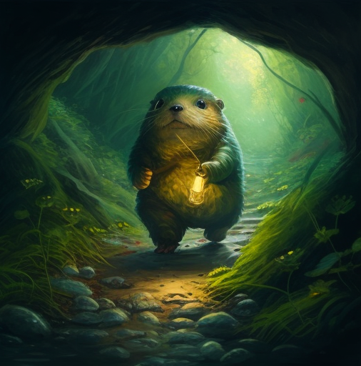

# Project: Gopher Adventure Game

Objective: In this workshop, participants will build a text-based adventure game featuring a Gopher exploring a mysterious world. Each chapter will focus on different aspects of the game, and participants will apply the concepts learned in each chapter to enhance the game.

## Chapter 1: Data Types in Golang - Creating the Game World

* Create basic game components using Golang's data types, such as characters, items, and locations.
* Implement the `createForestLocation` and `createVillageLocation` functions to create initial locations for the game world.
* Define structs to represent game entities like the player, enemies, and items.
* Use maps to store the relationships between different game locations.

## Chapter 2: Building the World Map and Game Mechanics

* Implement the `createWorldMap` function to connect Forest and Village locations.
* Create functions to handle player actions, such as moving and interacting with objects.
* Implement basic combat mechanics for the player and enemies.

## Chapter 3: Expanding the Game World and Adding Inventory

* Implement the `createCaveLocation` and `createCastleLocation` functions to add new locations to the game world.
* Implement inventory functions to allow the player to pick up and use items.

## Chapter 4: Interfaces and Polymorphism

* Use interfaces to define common behaviors for game entities, such as moving, attacking, and interacting with other entities.
* Implement polymorphism to enable different types of entities to be treated as the same type, allowing for more flexible game design.

## Chapter 5: Error Handling and Logging

* Implement error handling to manage unexpected situations and gracefully recover from errors.
* Add logging to track game events and assist with debugging and development.

## Chapter 6: Go Routines and Concurrency

* Use goroutines to manage concurrent game events, such as enemy movement, timed events, or real-time combat.
* Implement channels for communication between concurrent tasks.

## Chapter 7: Writing Tests and Mocking

* Write unit tests for various game components and logic, ensuring that the game functions as expected.
* Use mocking to isolate parts of the game for testing, such as replacing real game entities with mock versions.

## Chapter 8: Packaging and Deployment
* Organize the game code into packages for easier management and maintainability.
* Learn how to build and deploy the game, allowing others to play and enjoy the Gopher Adventure.

## Teaser
Throughout the workshop, participants will build and improve the Gopher Adventure game, applying the concepts they learn in each chapter to create a fun and entertaining project. Encourage participants to be creative and add their unique ideas to the game, making it a truly collaborative and enjoyable learning experience.

## Question

I want to build a workshop for learning golang for beginners. It should be interactive, so ideally there are some prepared tests and the participants have to complete the source until the tests are fixed. they learn the basics of golang while coding. I want to cover topics like data types, struct, interfaces, compositions, design patterns, go routines and concurrency, writing tests correctly with mocked structs. Lets start with chapter one. It should handle different data types in golang 

for the whole workshop a want to build up an entertaining project. every chapter should further improve and extend the project. It will be the red thread through the whole workshop. the project can be creative like a game and should be entertaining and fun to complete. Can you give a suggestion?